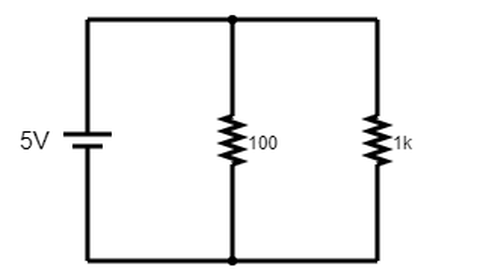
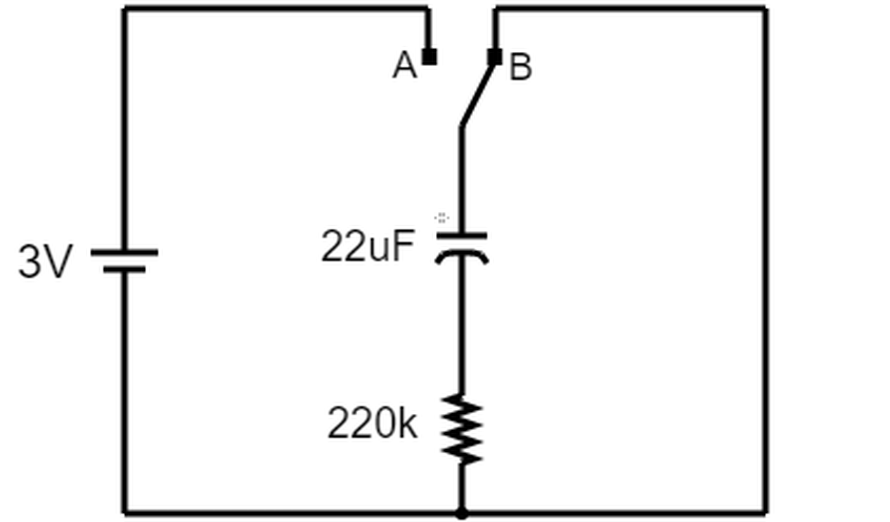

# Exercício 01

Implemente um circuito abaixo e responda as questões que seguem.



*Figura 1 – Circuito com resistores.*

1. Envie o arquivo da simulação como um link Falstad (*Circuit Simulator Falstad → Arquivo → Exportar como Link*)

    [Circuito 1](https://www.falstad.com/circuit/circuitjs.html?ctz=DwYwlgTgBAZgvAIgIwKgFwM6IAwDpsEECsqYIiSeATAVQOx0DM2AHFQGwCcndqIARoiLZUAB0EIALI1QA3CENQBbTEICmAWiQoAfACgoUYAHcoADwp12UJJMlRGNG3dTwEIgPT7DJ85euMRFQOToFUrjgIXgZGsn7IVg5BNom2khHI7KjGbiJQSgCGZrKK0T6mFgiO2EnBdiy1GZ7eRhWI1c729Z1NUS3A0JUdaSE1Yb1QCsgEfTED8d00Dd3VE1OUM2WtC5INHStBvVu+ld1IiWfsebmz5TsNSFdQZy6wkccAgkpKamhqg4gzhddlAlhkZPk1JEoBhyO5ZsAPOAIPogA)

2. Calcule a tensão e a corrente que passa pelo resistor de 1k.

    **Resposta:** O resistor de $1\,\text{k}\Omega$ está em paralelo com a fonte, logo a tensão sobre ele é a própria tensão da fonte:

    ```math
    V_{1k} = V_{fonte} = 5\ \text{V}
    ```

    Pela Lei de Ohm, $I = \dfrac{V}{R}$:

    ```math
    I_{1k} = \frac{V_{1k}}{R_{1k}} = \frac{5\ \text{V}}{1000\ \Omega} = 0{,}005\ \text{A} = 5\ \text{mA}
    ```

3. Com o auxílio de um multímetro na função de amperímetro, meça a corrente que passa pelo resistor de 1k. **LEMBRE-SE** que o amperímetro deve ser ligado em série com o ramo do circuito.

    **Resposta:** O multímetro mediu uma corrente de $5\,\text{mA}$

4. Compare o valor medido com o valor calculado.

    **Resposta:** O valor calculado e o medido foram exatamente o mesmo.

5. Se tivéssemos utilizando um circuito com elementos reais (e não simulados), a corrente calculada seria exatamente a mesma da calculada? Justifique

    **Resposta:** Não. Isso aconteceria porque em um circuito real poderíamos ter interferência externo, ruído, tolerância de cada componente, entre outros fatores que poderiam gerar alterações nas medições.

# EXPERIMENTO 02: Carga e descarga de capacitores.

A Figura 2 apresenta um circuito RC com uma malha para carregar e descarregar o capacitor. Quando a chave encontra-se na posição A, o capacitor é carregado. Quando na posição B, o capacitor é descarregado.



*Figura 2 - Circuito RC.*

1. Envie o arquivo da simulação como um link Falstad (*Circuit Simulator Falstad → Arquivo → Exportar como Link*)

    [Circuito 2](https://www.falstad.com/circuit/circuitjs.html?ctz=DwYwlgTgBAZgvAIgIwKgFwM6IAwDpsEECsqYIiSeATAVQOx0DM2AHFQGwCcndqIARoiLZUAB0EIALI1QA3CENQBbTEICmAWiQoAfACgoUYLKgAPIXXZRGRKlCKWoSSZNTxk7VAHd3IqEoBDU1lEGShIHHxsFAB6fUNgLzMLK2dJKHY6OzS3HAQ4gyMk8wQHKxs7LOxrW1yEEQKE4sQWTnLbKFbUlzqG+KLkhCqauy6R3vz+xMHhiqhZmgnGgZKxtPnsdJzYPOXQQfYWFigaY+GqIk8d+r5IwmwqKlIQ+qiUKAwFG6hZABNIxh0JDsNJITiMZhUJBsSaFaYlc5HeY0E6XJZTaAIlGMFGIlgTKBfR73WEJADKByRpwySO2vlQXzwBHeABswHl0AALRBPArAGLgCD6IA)

2. Calcule a constante de tempo do circuito RC.

    **Resposta:** A constante de tempo de um circuito RC é dada por $\tau = R \cdot C$.

    Dado que $R = 220\,\text{k}\Omega$ e $C = 22\,\mu\text{F}$:

    ```math
    \tau = (22 \times 10^{4}\ \Omega)(22 \times 10^{-6}\ \text{F}) = 484 \times 10^{-2} = 4{,}84\ \text{s}
    ```

3. Utilizando a simulação, faça a permuta da chave para a posição A e meça o tempo que levou para a tensão sobre o capacitor sair de 0V e alcançar 1,9 V.

    **Resposta:** No simulador o tempo levado foi de $4{,}853\ \text{s}$

4. Discuta os seguintes questionamentos:

    a. O tempo medido foi similar à constante de tempo do circuito RC? Sabe por quê?

    **Resposta:** O tempo medido foi similar. Isso acontece porque o simulador utiliza um algoritmo que corresponde as fórmulas existentes.

    b. Se a resistência do circuito da Figura 2 for alterada para um valor de 100k, o tempo para a tensão do capacitor chegar em 1,9V é maior ou menor que o tempo medido com a resistência 220k? Justifique.

    **Resposta:** Diminui, pois como a constante de tempo é medido como um produto da resistência pela capacitância, temos que são grandezas diretamente proporcionais.

5. Retorne a chave para a posição B e observe o comportamento da tensão do capacitor. Explique o que acontece.

    **Resposta:** A fonte deixa de emitir corrente pois a mudança de chave a desconecta do ramo e a tensão acumulada pelo capacitor começa a diminuir, passando-se a se comportar como a fonte do circuito.