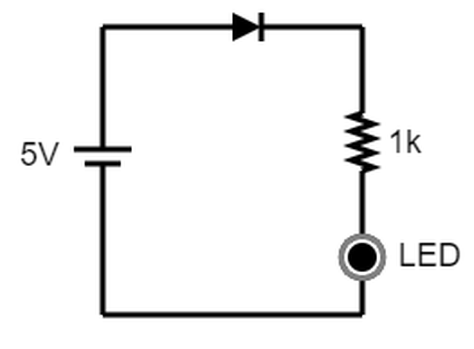
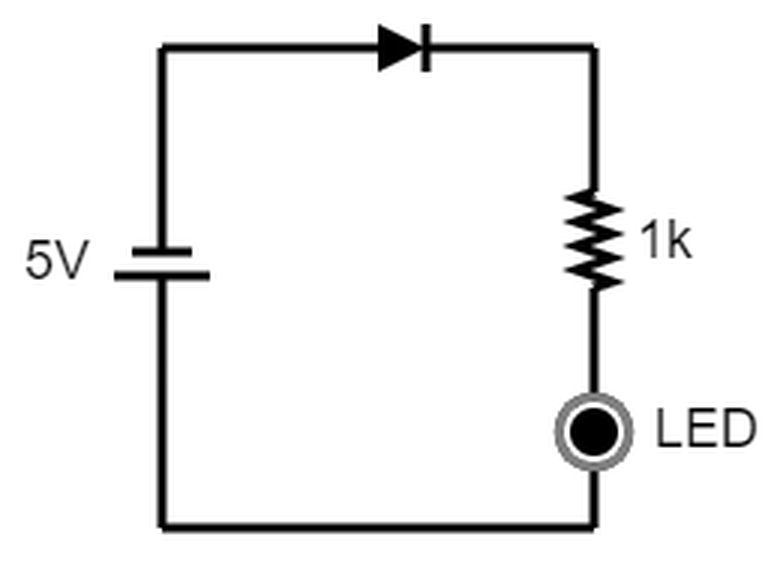
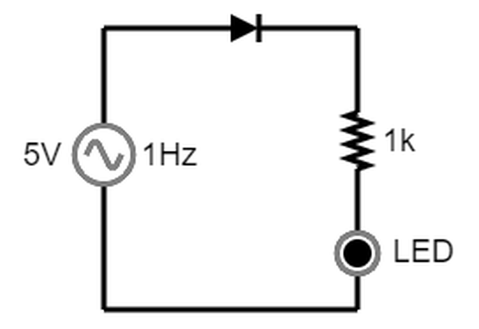
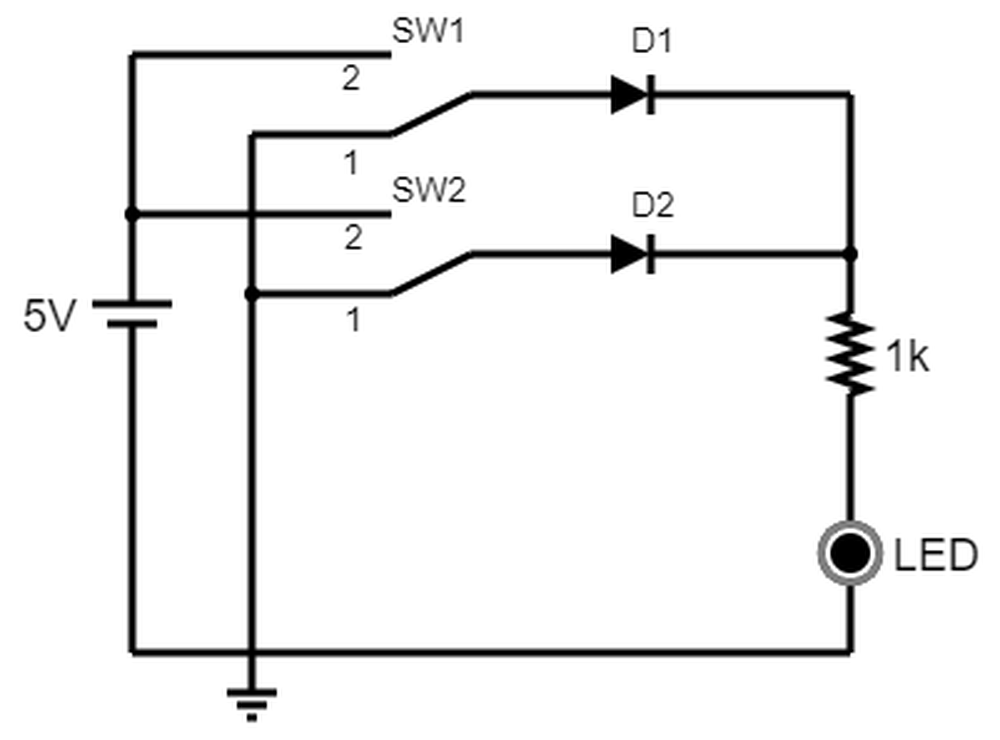
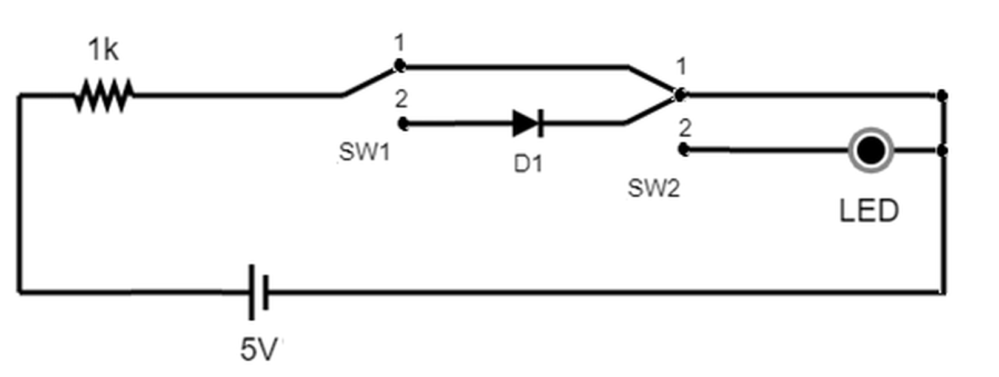

# EXPERIMENTO 01: Polarização direta versus Polarização reversa de Diodos.

*Figura 1 - Circuito de polarização direta.*

1. Monte o circuito da Figura 1, ligue a fonte de tensão e observe o comportamento do LED. Envie o arquivo da simulação como um link Falstad (*Circuit Simulator Falstad → Arquivo → Exportar como Link*). Qual o comportamento do LED?

    [Circuito 1](https://www.falstad.com/circuit/circuitjs.html?ctz=DwYwlgTgBAZgvAIgIwKgFwM6IAwDpsEECsqYIiAzABwBMuA7AGw1G1IAsFAnF9o+6hAAjREWyoADiISdUANwijUAW0yiApgFokKAHwAoKFGAATKAA9E7KlGtQujW1VTwE4qMoD2iE+pgBDAFcAGzQEAHoDI2AAGQBRABELRCRGbCgkJgy0jK4aFxwVbwRfAJC0TWD1E0FFZEEAc0KoYWblIXI3fBRIw2MAd2TkHKQ87PSaGgFYQt7o6Eth9Kp01NWaZxm3VDqkQgiogaG1jI3xjKYC7bmjxYcnc+sr8RvgQcWTyfYobUcv54OfTexxydhOKwBr3eiF+DzsTy2L0OwDkQ1hXx+qScV1SqH6rncyn85jkSigkBw+GwPQMwHC4AgBiAA)

    **Resposta:** O LED fica constantemente ligado

2. Meça a tensão em cima do resistor de 1k. Qual o valor encontrado? Explique o porquê da tensão ser menor que 5V.

    **Resposta:** Os diodos consomem uma parcela fixa de tensão, o que diminue a tensão restante para o resistor.

3. Calcule a corrente que passa pelo resistor 1k considerando que o LED vermelho opera em nível de tensão de 1,7V e o diodo com 0,7V. O valor calculado é igual ao medido no circuito simulado? Explique.

    **Resposta:**

    Considerando $V_{r}$ como a tensão no resistor, temos que:

    $$
    V_{r} = V_{fonte} - V_{diodo} - V_{LED}
    = 5 - 0{,}7 - 1{,}7
    = 2{,}6 
    $$

*Figura 2 - Circuito de polarização reversa.*

1. Monte o circuito da Figura 2, ligue a fonte de tensão e observe o comportamento do LED. Envie o arquivo da simulação como um link Falstad (*Circuit Simulator Falstad → Arquivo → Exportar como Link*). Qual o comportamento do LED?

    [Circuito 2](https://www.falstad.com/circuit/circuitjs.html?ctz=DwYwlgTgBAZgvAIgIwKgFwM6IAwDpsEECsqYIiAzABwBMuA7AGw1G1IAsFAnF9o+6hAAjREWyoADiISdUANwijUAW0yiApgFokKAHwAoKFGByoAD0QtGUdlShX7NAbERJGqAO7wE4qMoCGZnJKUJA4+NgoAPQGRsAe5pZE1rZQFDTYNlSo3uIxhsYJFjLpWTalVL65CPlxRYicNI7s9snNOTg1sYWJCBSMdqmNWR0+XQXxvcNINIOlSEyjed3A0MXDleVNM9kuY1CKyITjdVPzXE3DNE5LJ8YAMgCiACJn20xbUEgXt34A9ogACbqGD+ACuABs0JoIepAYJDigoCAAOadZHSXzKITkHz4aIrQG9dKZVL9Qa7ar-IEg8FQ8bAKLgCAGIA)

    **Resposta:**

2. De acordo com os comportamentos observados nos itens 1 e 4, qual é a diferença entre os dois circuitos de polarização?

3. Refaça o circuito sem o diodo e observe o comportamento do LED sem o diodo. Houve alguma diferença? Qual o motivo?

*Figura 3 - Circuito de polarização direta com fonte de tensão CA.*

7. Monte o circuito da Figura 3. Configure o gerador de sinais para gerar uma função senoidal de 5V de pico e frequência de 1Hz. Responda os seguintes itens:

    [Circuito 3](https://www.falstad.com/circuit/circuitjs.html?ctz=DwYwlgTgBAZgvAIgIwKgFwM6IAwDpsEECsqYIiAzABwBMuA7AGw1G1IAsFAnF9o+6hAAjREWyoADiISdUANwijUAW0yiApgFokKAHwAoKFGByoAD1E0qUGjXZQiVqOyqp4yRqgDu7lLEXIKgCGZnJKUJA4+NgoAPQGRsBe5pbWLg5cNM6usDgI8YbGyRYI9Nj26WX2VOK5COIFicWIVTZ2Dk62AnUNCUUpCPzY2VCtLm55jf0lrUhOs0wT9fl9wNAz5VA1o5tzOe61AUiEK4VJA7OZO-ZdS71nADIAogAiF7tM11BImXcqAPaIAAm6hgQQArgAbNCaSHqIGCI6CADmeSgwjRyiE5Hq+DiqyBAyIV3SQ2yfygykBCBBYKhaFOwFi4AgBiAA)

   a. O LED acende em algum momento? Com que frequência acontece?

   b. O que acontece com a tensão no resistor 1k quando o sinal senoidal permanece no eixo da tensão negativa? Qual o motivo deste comportamento?

# EXPERIMENTO 02: Portas lógicas com Diodos.

*Figura 4 - Simulação de porta lógica com Diodos.*

1. Monte o circuito da Figura 4. Envie o arquivo da simulação como um link Falstad (*Circuit Simulator Falstad → Arquivo → Exportar como Link*).

2. A alteração das chaves SW1 e SW2 para a posição 2 (sinal de tensão 5 V) representa o nível lógico 1. O nível lógico 0 é representado pela posição 1 (sinal de 0 V) das chaves. Observando o comportamento da carga (o LED) no circuito da Figura 4, qual porta lógica o circuito representa?

*Figura 5 - Simulação de porta lógica com Diodos.*

3. Monte o circuito da Figura 5 e analise o comportamento. Envie o arquivo da simulação como um link Falstad (*Circuit Simulator Falstad → Arquivo → Exportar como Link*).

4. A alteração das chaves SW1 e SW2 para a posição 2 representa o nível lógico 1. O nível lógico 0 é representado pela posição 1 das chaves. Observando o comportamento da carga (o LED) no circuito da Figura 4, qual porta lógica o circuito representa?